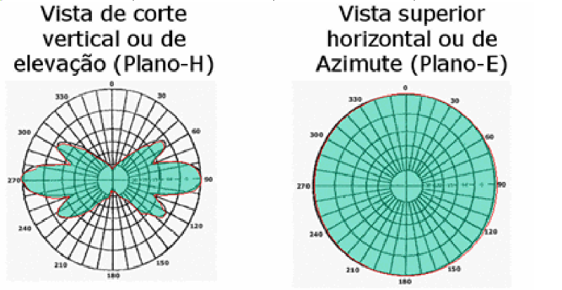

  

# MELHORE SEU WIFI CONSTRUINDO UM AMPLIFICADOR DE SINAL, E A SEGURANÇA DA REDE
- ### ROTEADOR WIFI: MELHORANDO A QUALIDADE DE SINAL E A SEGURANÇA DA REDE
  

## O QUE É

  - O roteador *wireless* tem seu nome que significa:
    - *wire* - fio
    - *less* - livre
  
  - ***Wi-Fi*** é uma marca registrada da **Wi-Fi Alliance**. É utilizada por produtos certificados que pertencem à classe de dispositivos de rede local sem fios (WLAN) baseados no padrão IEEE 802.11. Por causa do relacionamento íntimo com seu padrão de mesmo nome, o termo Wi-Fi é usado frequentemente como sinônimo para a tecnologia IEEE 802.11.  
  
  - As principais tecnologias do padrão 802.11: a/b/g/n/ac/ad, a velocidade e a frequência varia de uma tecnologia para outra.  
  
  - As tecnologias sem fio mais utilizadas são:
    - ***WiFi***  
      
    
    - ***Bluetooth***   
      
    
    - ***Banda Larga Móvel***  
        
        
    
    - ***Satélite***  
        
      

## COMO FUNCIONA
  
  - *WLAN's* usam ondas de radio para transmissão de dados. Comumente podem transmitir na faixa de frequência 2.4 Ghz ou 5 Ghz. Comunicações sem fio utilizam-se de ondas eletromagnéticas para o
envio de sinais através de longas distâncias.
  
  - Todos os dispositivos sem fio operam no intervalo de ondas de rádio de espectro eletromagnético. A ITU-R (International Telecommunication Union - Radiocommunication Sector) - Setor de Radiocomunicação da União Internacional de Telecomunicações - é responsável por regular a alocação de espectros de radiofrequências (RF).  
      
    
      
  - **Antena Omni-Direcional**  
     
     
  
  - **Antena Semi-Direcional**  
      
  
  - **Antena Direcional**  
     
  
  - Observação: as redes WLAN operam na faixa de frequência ISM de 2,4 GHz e na faixa UNII de 5 GHz.  

  - Ondas de rádio têm algumas propriedades inesperadas se comparadas com o cabo de Ethernet, Por exemplo, é muito fácil ver o caminho que o cabo Ethernet faz: localize o conector que sai de seu computador, siga o cabo até a outra ponta e você descobriu.  
    Mas como você sabe para onde as ondas que emanam de seu cartão wireless estão indo? O que acontece quando estas ondas chocam-se com os objetos da sua sala ou com os prédios de sua conexão externa? Como vários cartões wireless podem ser usados na mesma área, sem que um interfira com o outro?  
      
      
      

  **HOTSPOT**

  - São pontos de acesso wireless que permitem ao usuário conectar-se na internet estando em locais públicos como aeroportos shoppings, hotéis, cafeterias, etc.  
  
  - Basta um laptop com um PCCard e uma conta de acesso da provedora do serviço para estar navegando na internet nesses locais, não esquecendo que o usuário é cobrado pelo uso do serviço.  

## ONDE E COMO SURGIU

  - As Redes sem fio ou wireless (WLANs) surgiram da mesma forma que muitas outras tecnologias, no meio militar. Havia a necessidade de implementação de um método simples e seguro para troca de informações em ambiente de combate.  
  
  - O tempo passou e a tecnologia evoluiu, deixando de ser restrita ao meio militar e se tornou acessível a empresas, faculdades e ao usuário doméstico. Nos dias de hoje podemos pensar em redes wireless como uma alternativa bastante interessante em relação as redes cabeadas.  

## QUAL A UTILIDADE

  - Suas aplicações são muitas e variadas e o fato de ter a mobilidade como principal característica, tem facilitado sua aceitação, principalmente nas empresas.  
  
  - Sistemas de Acessos Wireless podem prover aos usuários acesso à Internet em tempo real em qualquer lugar, dentro da área de cobertura.  
  
  - Os equipamentos *Wireless* tem baixo consumo de energia elétrica e são projetados para ficarem permanentemente ligados. Com isto, a rede local e a conexão com a Internet está disponível 24 h.  
  
  - **Problemas de Propagação:** As ondas eletromagnéticas na frequência de 2,4 GHz
  encontram dificuldades para se propagar através de paredes
  grossas de alvenaria, lajes de concreto armado, bem quando
  existem grades e portões metálicos no local.  
  Devido a obstáculos que se encontram no meio das transmissões e recepções wireless LAN, o sinal tende sofrer:  
  
  - *Reflexão*  
    
  
  - *Refração*  
    
  
  - *Difração*  
    
  
  - *Espelhado*  
    
  
  - *Absorção*  
    

  - Hoje em dia a utilização das WLANs deixou de estar restrito a grandes empresas ou faculdades. Com os preços dos equipamentos mais acessíveis, elas acabaram atraindo a atenção do usuário comum devido a sua ampla gama de possibilidades de utilização. Os mais comuns são:
    - Expansão da Rede Cabeada  
    - Conexão entre prédios  
    - Serviços de Última Milha  
    - Mobilidade  
    - Escritórios Móveis  
    - Hotspots  
    - Uso doméstico  

## MELHORANDO A SEGURANÇA DA REDE

  Todos os roteadores *wi-fi* possuem uma configuração padrão, em baixo dos dispositivos existe um selo com o login para configurações, o mais utilizado é o `192.168.0.1`, e para logar basta utilizar as credenciais fornecidas, no noso caso, usuario e senha é `admin`. 
  - ***Lebrando que as configurações de cada um pode variar de cada modelo e fabricante.***   
  - Para começãr, abra o navegador e entre no endereço fornecido pelo seu dispositivo. Vamos inserir o nosso `192.168.1.1`.
    
  - Na primeira tela teremos algumas informações sobre o sistema, como IP da rede, tipo de conexão, endereço MAC, etc.  
    
  - Vamos na aba ***Wireless***, na primeira tela poderemos configurar o nome que queremos para a nossa rede, opção de canal para transmissão, etc.  
    
  - Na guia de ***segurança*** poderemos alterar a senha do dispositivo.  
    .  
    É recomendavel utilizar senhas complexas, com letras maiúsculas e minúsculas, numeros e caracteres epeciais, dificultando uma quebra de senha no caso de um malware tentar acesso.  

# REFERÊNCIAS
  
  - [FATEC - Faculdade de Tecnologia](http://www.fatecbauru.edu.br/) - [www.fatecbauru.edu.br](http://www.fatecbauru.edu.br/) 
  - [youtu.be/TGg3U_KO5Y0](https://youtu.be/TGg3U_KO5Y0) - Manual do Mundo, Turbinar Wi-Fi com LATA DE ALUMÍNIO realmente funciona?
  - [github.com/gvieira29/wifi](https://github.com/gvieira29/wifi) - GitHub  
    ```
    ~$ www.vestibularfatec.com.br  Inscrições De 15/10 até 11/11/2019
    ```